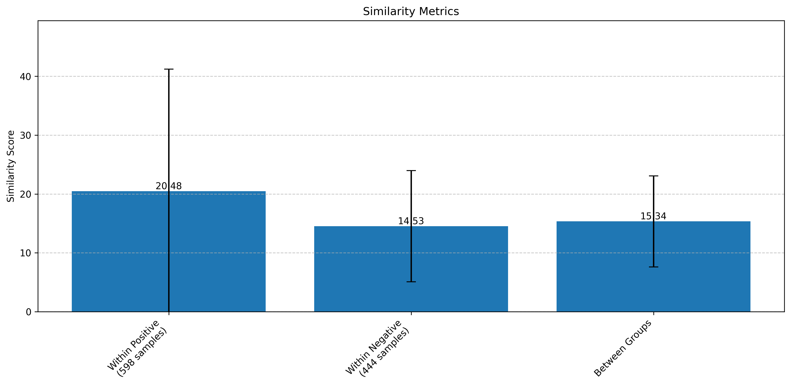

# Sequence Analysis Results

## Dataset Overview
- Total sequences: 1,042
- Positive samples: 598 (57.4%)
- Negative samples: 444 (42.6%)
- Dataset: [avpdb.csv](../datasets/avpdb.csv)

## Clustering Analysis

### K-means Clustering
- Number of clusters: 2
- Cluster sizes: 734 and 308 sequences
- Inertia: 252,858,991.60

### DBSCAN
- Number of clusters: 1
- Noise points: 1042
- No significant clusters found

### Spectral Clustering
- Number of clusters: 2
- Cluster sizes: 974 and 68 sequences

## Sequence Similarity Analysis
- Total comparisons: 542,361
- Similarity range: 0.0 to 264.0
- Mean similarity: 16.89
- Quartiles [Q1, Q2, Q3]: [11.0, 15.0, 19.0]

### Group-wise Similarity
- Within positive samples: 20.48 ± 20.75
- Within negative samples: 14.53 ± 9.46
- Between groups: 15.34 ± 7.74

## Machine Learning Performance
### Random Forest
- Mean accuracy: 58.4% ± 12.9%

### Support Vector Machine
- Mean accuracy: 52.5% ± 5.7%

## Sequence Properties
### Property Correlations with Similarity
| Property | Correlation | P-value |
|----------|------------|---------|
| Molecular Weight | 0.344 | 2.24e-30 |
| Aromaticity | 0.101 | 1.12e-03 |
| Hydrophobicity | 0.101 | 1.14e-03 |
| Hydrophobic Ratio | 0.185 | 1.86e-09 |
| Amphipathicity | 0.098 | 1.54e-03 |
| Helix Propensity | 0.232 | 2.97e-14 |

## Additional Visualizations
### Sequence Composition

### Sequence Length Distribution

### Principal Component Analysis

---
*Analysis timestamp: 2025-02-26 00:59:56*
